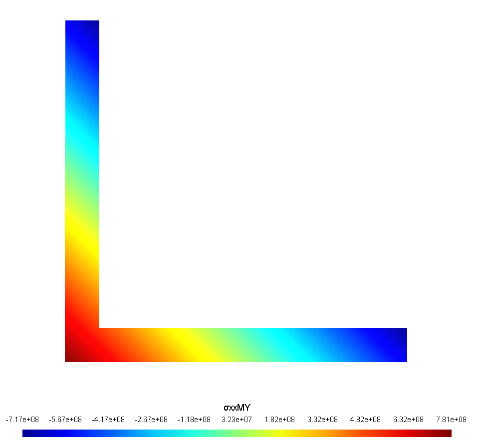

# P2Poffo
Programa Pré e Pós processamento de seções transversais utilizando MEF.

## Installation:

```bash
]add https://github.com/CodeLenz/P2Poffo
```

## Pré-Processamento
Esta etapa do programa tem como objetivo utilizar o software livre Gmsh para a geração da malha, de modo a obter as propriedades da seção transversal no sistema principal.

Retorno do Programa:
```bash
    (cx,cy) - Centroides da seção
    area    - Área da seção
    Izl     - Segundo momento de área em relação ao eixo z 
    Iyl     - Segundo momento de área em relação ao eixo y 
    Jeq     - Momento de inércia polar 
    α       - Ângulo formado entre o eixo de referência original e o eixo de referência principal
    ∇Φ      - Vetor com Gradiente da função de Airy de todos os elementos da malha
```

### Formato do arquivo de entrada
Os arquivos de entrada podem estar nos formatos .geo ou .msh. No caso de arquivos .geo, o programa utiliza a biblioteca interna do Gmsh para a geração da malha, enquanto os arquivos .msh já contêm diretamente as informações da malha.


Arquivo .geo para a leitura no GMSH e geração de malha, exemplo com seção circular

Raio da seção transversal
```bash
R = 1E-2;
```

Tamanho do elemento
```bash
lc = R/30;
```

Pontos da circunferência com o sistema de referência na esquerda baixo.

Point(ID) = {coordenada em x, coordenada em y, coordenada em z, tamanho do elemento ao redor do nó}
```bash
Point(1) = {   R,    R,   0, lc};
Point(2) = { 2*R,    R,   0, lc};
Point(3) = {   R,  2*R,   0, lc};
Point(4) = {   0,    R,   0, lc};
Point(5) = {   R,    0,   0, lc};
```


Circle(ID) = {nó inicial, nó central da circunferência, nó final};
```bash
Circle(1) = {2,1,3};
Circle(2) = {3,1,4};
Circle(3) = {4,1,5};
Circle(4) = {5,1,2};
```


Curve Loop(ID) = {curva1, curva2, curva3, curva4};
```bash
Curve Loop(1) = {1,2,3,4};
```

Plane Surface(ID) = {ID};
```bash
Plane Surface(1) = {1};
```

Material: Precisa para o conversor do Lgmsh

Physical Surface("Material,nome do material,ID,E,ν,ρ") = {ID};
```bash
Physical Surface("Material,aço,1,210E9,0.3,7850.0") = {1};
```

Prende todos os nós do contorno, ordem para tem que ser do conversor.

Physical Curve("U,1,0,0")= {conectividades(1 ao 4)}; 
```bash
Physical Curve("U,1,0.0") = {1:4};
```

Até aqui, informações para gerar a malha, agora a malha será manipulada.

Converte os triângulos para retângulos
```bash
Recombine Surface{:};
```
Algoritmo para geração de malha
```bash
Mesh.Algorithm = 8;
```
Cria a malha
```bash
Mesh 2;
```
Grava a malha com .msh
```bash
Save "circular.msh";
```

### Exemplo
Dada uma seção em L com as seguintes dimensões
```bash
a = 1 cm
b = 1 mm
```

<p align="center">
  
</p>

Criando o arquivo L.geo
#### L.geo
```bash
a = 1E-2;
b = 1e-3;

lc = a/20;

Point(1) = {   0 ,   0,   0, lc};
Point(2) = {   a ,   0,   0, lc};
Point(3) = {   a ,   b,   0, lc};
Point(4) = {   b,    b,   0, lc};
Point(5) = {   b,    a,   0, lc};
Point(6) = {   0,    a,   0, lc};

Line(1) = {1,2};
Line(2) = {2,3};
Line(3) = {3,4};
Line(4) = {4,5};
Line(5) = {5,6};
Line(6) = {6,1};

Curve Loop(1) = {1,2,3,4,5,6};
Plane Surface(1) = {1};

Physical Surface("Material,aço,1,210E9,0.3,7850.0") = {1};

Physical Curve("U,1,0.0") = {1:6};

Recombine Surface{:};

Mesh.Algorithm = 8;

Mesh 2;

Save "L.msh";
```
#### Rodando o exemplo
No prompt de comando
```bash
cd Local arquivo
```
Inicie o julia
```bash
julia
```
Utilize o pacote e verifica as dependência
```bash
using P2Poffo
```
Rode o arquivo do exemplo
```bash
Pre_processamento("malhas/L.geo") 
```
#### Resultados
Para os resultados relacionados à seção transversal, observam-se diferenças quanto à dependência da discretização por elementos finitos:

1) Propriedades independentes de elementos finitos:

a) Centroide 

b) Área 

c) Segundos momento de área(Izl,Iyl)

d) Ângulo 𝛼

Essas propriedades são obtidas diretamente a partir dos primeiros momentos de área, ou seja, não dependem do tamanho ou da densidade da malha de elementos finitos.

2) Propriedades dependente de elementos finitos:

a) Função de Airy

b) Jeq da seção 

Com isso, notamos que a convergência do Jeq 
<p align="center">
  
</p>

A distribuição da função de airy na seção pode ser encontrada na pasta Pos com o prefixo "∇Φ" e com o nome do arquivo ".pos". A visualização tambem foi utilizando o Gmsh
<p align="center">
  
</p>

Resultados das propriedade da seção tranvesal:
```bash
    cx    = 0.002868421052631579  [m]
    cy    = 0.0028684210526315787 [m]
    area  = 1.8999999999999998e-5 [m^2]
    Izl   = 2.865833333333282e-10 [m^4] 
    Iyl   = 7.342543859648254e-11 [m^4]
    Jeq   = 6.178847989325534e-12 [m^4] 
    α     = 45.0                  [°]
```
## Exportando os dados
Por vezes, é necessário determinar as propriedades das seções transversais para o cálculo dos deslocamentos da estrutura, uma vez que tais propriedades são fundamentais para a construção da matriz de rigidez. Nesse contexto, o P2Poffo pode ser utilizado como ferramenta de pré-processamento, ainda que sem a visualização da função de Airy. As propriedades calculadas são armazenadas na pasta geometria, com o mesmo nome do arquivo de entrada no formato.sec esse formato está compatível com o LFrame no formato de entrada das geometrias no .yaml

Ordem que o arquivo .sec é salvo
```bash
geo - Nome da geometria
area   - Área da seção
Izl     - Segundo momento de área em relação ao eixo z 
Iyl     - Segundo momento de área em relação ao eixo y 
Jeq     - Momento de inércia polar 
α       - Ângulo formado entre o eixo de referência 
```
#### Rodando a rotina
Utilizando a mesma geometria (em "L"), arquivo de entrada pode ser no formato .geo ou .msh
```bash
Exporta("malhas/L.geo")
```
ou
```bash
Exporta("malhas/L.msh")
```
#### Resultados 
Os resultados são encontrados na pasta geometria com geo.sec, para a geometria em L com a malha convergida. 
```bash
geo   = L                     [ - ]
area  = 1.8999999999999998e-5 [m^2]
Izl   = 2.865833333333282e-10 [m^4] 
Iyl   = 7.342543859648254e-11 [m^4]
Jeq   = 6.178847989325534e-12 [m^4] 
α     = 45.0                  [ ° ]
```

## Pós-Processamento
Para o pós-processamento deve-se utilizar um arquivo que informa os esforços internos de cada elemento. Para elementos de porticos podemos utilizar o LFrame para a gerar esse arquivo automaticamente, o detalhemento do uso da função está no README do LFrame. Lembrando que para realizar o Pós-Processamento, é necessario que seja uma geometria com malha realizada pelo Gmsh, se no local da pasta do arquivo de esforços não ter um arquivo.geo com a geometria da seção não irá funcionar.

O arquivo de esforços deve estar na seguinte formatação "arquivo.esf". 

A primeira linha precisa conter a String
```bash
Esforcos
``` 
As demais linhas contem a geometria da seção transversal com os esforços internos indo do primeiro ao sexto grau de liberdade no nó 1 e do primeiro ao sexto grau de liberdade no nó 2.
```bash
L  Nx1 Vy1 Vz1 Tx1 My1 Mz1 Nx2 Vy2 Vz2 Tx2 My2 Mz2
``` 
### Exemplo 
Seja um portico engastado, com F e P com valores de 100N e T assumindo 50Nm e com comprimento de 2m.

<p align="center">
  
</p>

Para obter os esforços internos utilizou-se o LFrame, Com as propriedades de seção convergidas e com as informações necessaria para a criação do yaml, obteve-se os esforços internos.

Criango o arquivo L.esf
```bash
Esforcos
L  -100.0 -70.7106781186547 70.71067811865474 -50.0 -14.142135623730956 -14.142135623730951 100.0 70.7106781186547 -70.71067811865474 50.0 1.2520473539146675e-14 1.0658141036401503e-14
```

Com o arquivo de esforços precisamos decidir qual elemento e nó vamos querer analisar a tensão, a função utilizada será
```bash
Pos_processamento(arquivo_esforcos, elemento, nó)
```

Para o nosso exemplo, temos somente um elemento e o nó mais solicitado será o 1, dessa forma,

```bash
cd Local arquivo
```
Inicie o julia
```bash
julia
```
Utilize o pacote e verifica as dependência
```bash
using P2Poffo
```
Rode o arquivo do exemplo
```bash
Pos_processamento("malhas_pre/L.esf", 1, 1)
```

Para o nosso exemplo, o arquivo .pos está com o seguinte nome: "L_1_1.pos". Pois ele salva a "geometria_elemento_nó.pos".

### Visualisação no Gmsh
O usuario deverá abrir o Gmsh, ir em File -> Open -> L_1_1.pos -> abrir. Se caso a visualização da malha estiver atrapalhando o pós processamento, pode desabilitar. Botão direito na malha -> Mesh Visibility - > desativar todas as opções.

Para a visualização, temos todos as tensões no sistema central principal de inercia e com maior magnitude temos σxx devido ao momento em y, lembrando que aqui não está considerando sobreposição de efeitos.
<p align="center">
  
</p>

